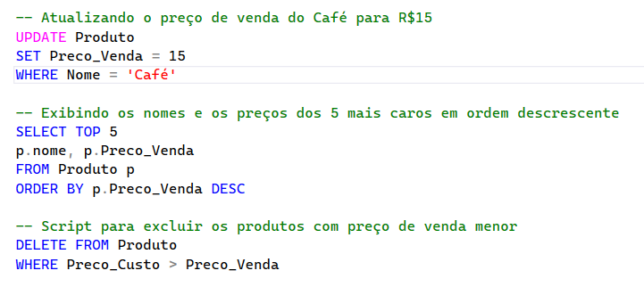
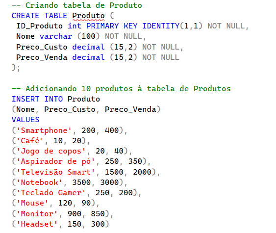
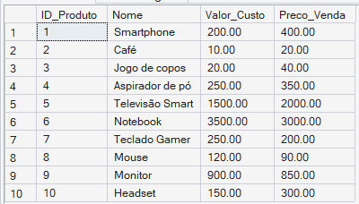

# 🗄️ SQL Server - Desafio Iniciante

Projeto desenvolvido para praticar fundamentos de SQL Server e manipulação de dados utilizando SQL SERVER.

Durante o desenvolvimento foram aplicados conceitos essenciais de banco de dados relacionais, com foco em organização de código, estruturação de scripts SQL e boas práticas de desenvolvimento.

---

# 📸 Imagens do projeto

## 📌 Especificações do desafio



---

## 📌 Criação da tabela e inserção dos registros



---

## 📌 Resultado das consultas e manipulação dos dados



---

# 🚀 Tecnologias utilizadas

* SQL Server

---

# 📚 Conceitos abordados

* Criação de tabelas
* Manipulação de registros
* Consultas SQL
* Atualização de dados
* Exclusão de registros
* Ordenação de resultados
* Chave primária

---

# 🛠️ Funcionalidades implementadas

* ✔️ Criação da tabela `Produto`
* ✔️ Inserção de múltiplos produtos
* ✔️ Atualização do preço de venda do produto `Café`
* ✔️ Consulta dos 5 produtos mais caros
* ✔️ Ordenação com `ORDER BY DESC`
* ✔️ Exclusão de produtos com prejuízo
* ✔️ Estruturação e organização do script SQL

---

# 📂 Estrutura do projeto

```text
SQL-INICIANTE/
│
├── assets/
│   ├── create-insert.png
│   ├── especificacoes.png
│   └── result.png
│
└── SQL-Iniciante.sql
```

---

# 🎯 Objetivo

Este projeto foi criado com o objetivo de fortalecer conhecimentos em SQL Server, praticar comandos fundamentais da linguagem SQL e desenvolver maior organização na construção de scripts e projetos relacionados a banco de dados.

---

# 👨‍💻 Desenvolvido por

Gabriel Costa Domiciano
